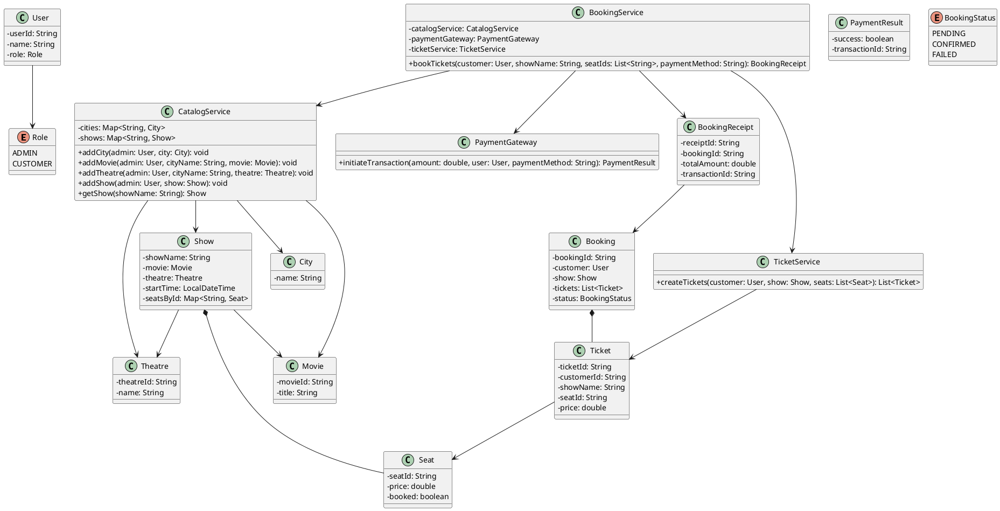
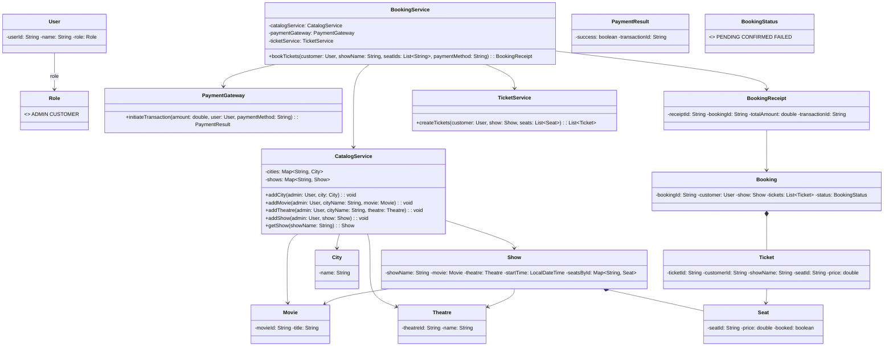

## BookMyShow (LLD)

### UML (PlantUML)



### UML (Mermaid - renders on GitHub)



### What’s implemented

This folder contains a runnable Java implementation of a simplified BookMyShow LLD:
- `CatalogService` manages `City`, `Movie`, `Theatre`, `Show`
- `BookingService` reserves `Seat`s, calls `PaymentGateway`, generates `Ticket`s, and returns a `BookingReceipt`

### How to Run

```bash
cd BookMyShow/MovieTicketBookingSystem

# compile (requires Java)
mkdir -p out
javac -d out $(find src -name "*.java")

# run
java -cp out Main
```

