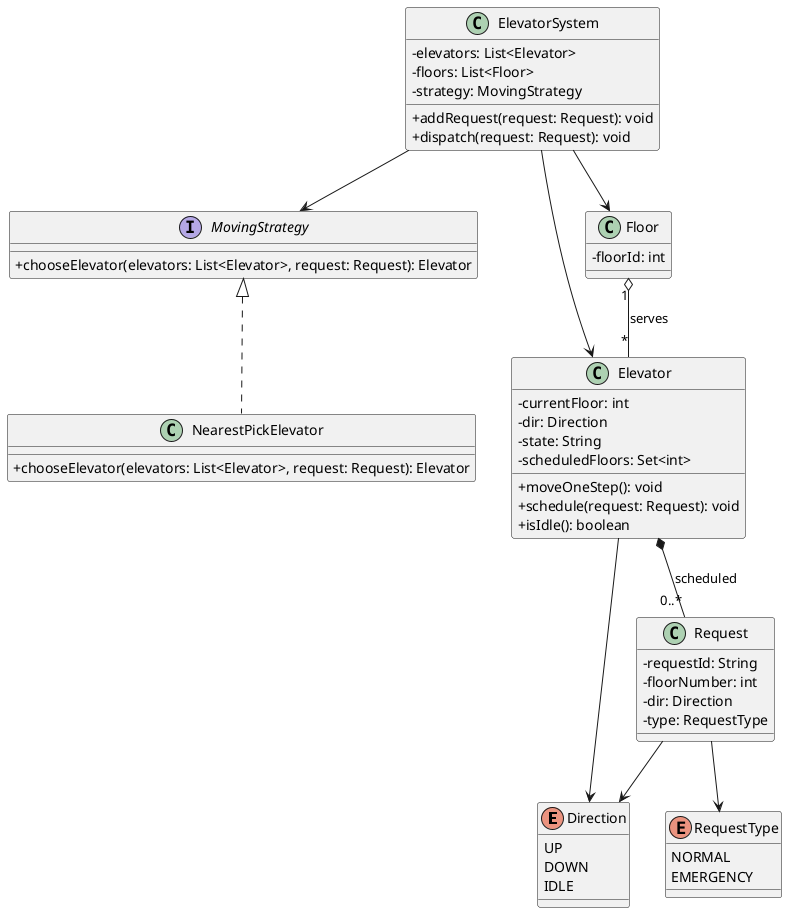
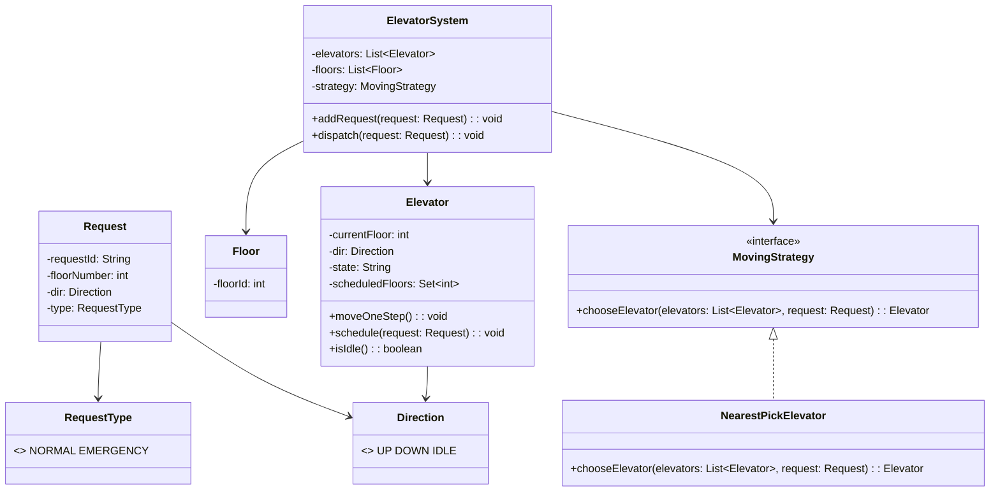

## Elevator LLD (UML)

### UML (PlantUML)



### UML (Mermaid - renders on GitHub)



### Java Code

Java implementation is in `Elevator/src/`:
- `Direction`, `RequestType`, `Request`
- `Floor`
- `MovingStrategy`, `NearestPickElevator`
- `Elevator`, `ElevatorSystem`
- `Main` (demo)

How to run (requires Java):

```bash
cd Elevator
mkdir -p out
javac -d out src/*.java
java -cp out Main
```

