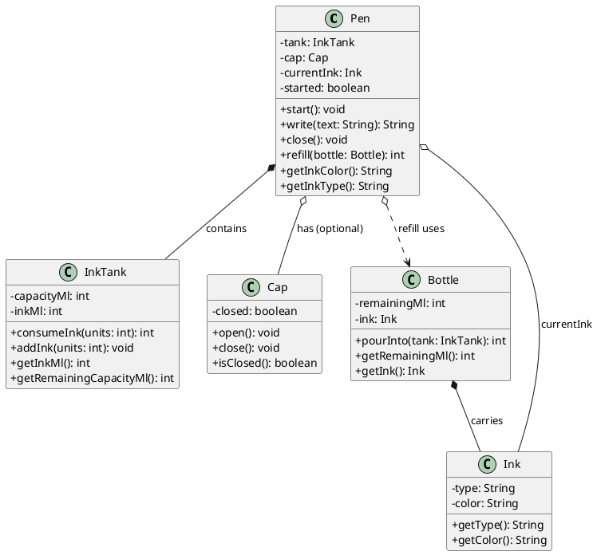
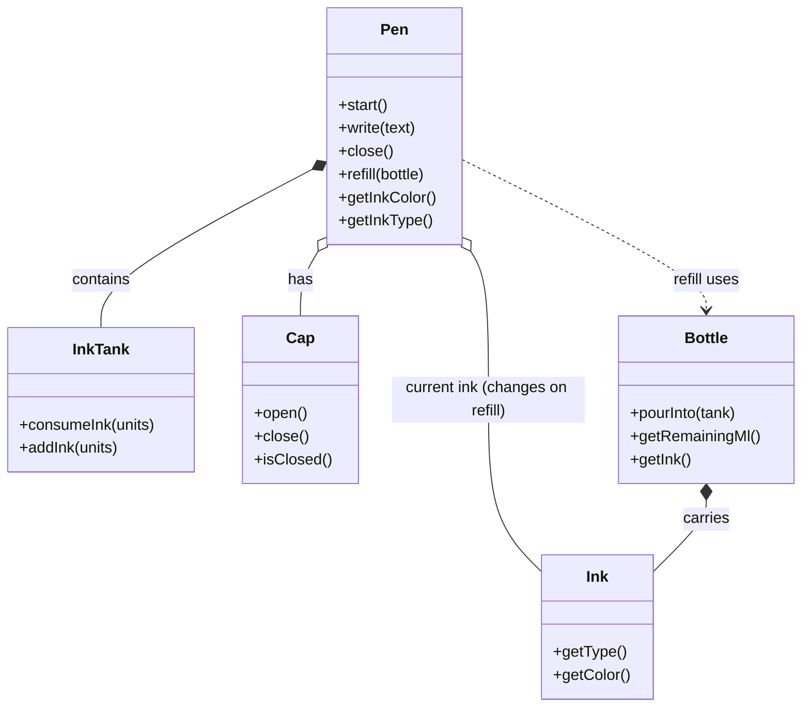

## Pen Design (Composition + Aggregation UML)

This folder contains a simple **Pen** implementation with these functionalities:
- `start()` (opens the cap / activates the pen)
- `write(text)` (consumes ink and returns what was written)
- `close()` (closes the cap / deactivates the pen)
- `refill(bottle)` (refills ink from an external bottle)

### UML Class Diagram (PlantUML)

### Relationship meaning
- **Composition (`*--`)**: the `Pen` contains an `InkTank`. When the `Pen` goes away, the tank is considered part of the pen.
- **Aggregation (`o--`)**: the `Pen` has a `Cap`, but the cap is not owned with the same strict lifetime as the tank.
- **Refill dependency (`o..>`)**: a `Bottle` is provided from outside; the pen does not own the bottle.

### Relationship Picture (Mermaid)

### What I added (where) - quick notes
- In `Pen.start()`: opens the `Cap` and sets `started=true`.
- In `Pen.write()`: consumes ink from `InkTank` (1 ink unit per written character).
- In `Pen.close()`: closes the `Cap` and sets `started=false`.
- In `Pen.write()`: throws different exception messages:
  - if it is a click pen (no cap) and you didn't start it, it throws "Click pen is not clicked yet..."
  - if cap is closed, it throws "Cap is closed..."
  - if ink is not enough for the full text, it throws "Out of ink. Refill first."
- In `Pen.refill(bottle)`: uses the external `Bottle` to pour ink into `InkTank` AND updates the pen's `currentInk` (so color/type changes every refill).

### Demo
Run:
- `PEN/src/com/example/pen/Main.java`

