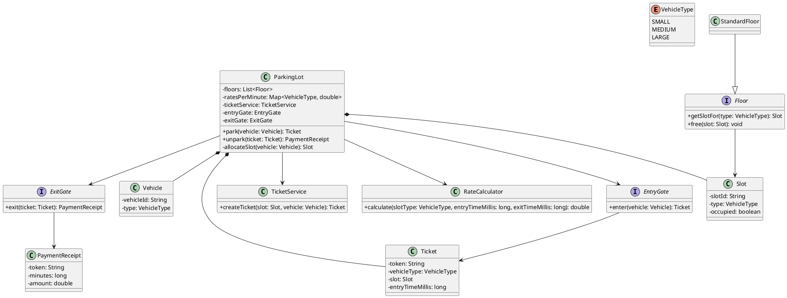
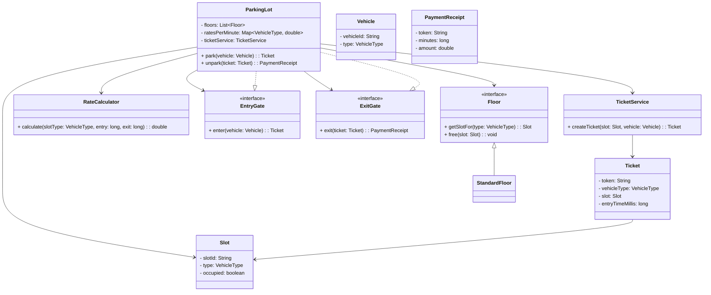

## Parking Lot Design (UML + Implementation)

This folder contains a Parking Lot (LLD-style) application based on the class diagram structure shown in your sketch.

### UML Class Diagram (PlantUML)



### Mermaid Class Diagram (renders on GitHub)



### How to Run

```bash
cd ParkingLot

# compile (requires Java)
javac -d out $(find src -name "*.java")

# run
java -cp out com.example.parkinglot.Main
```

### Console Inputs (quick)
- Enter `floors`
- Enter `smallSlotsPerFloor`, `mediumSlotsPerFloor`, `largeSlotsPerFloor`
- Enter `ratePerMinuteSmall`, `ratePerMinuteMedium`, `ratePerMinuteLarge`

Then repeatedly:
- `park <vehicleId> <SMALL|MEDIUM|LARGE>`
- `exit <ticketToken>`
- `quit`

