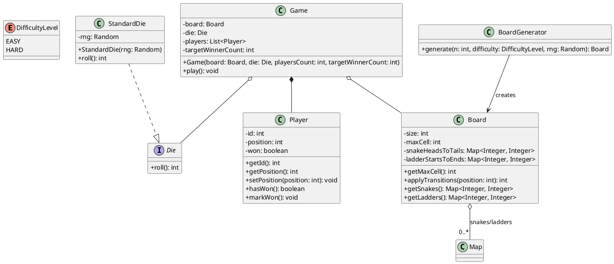

## Snakes & Ladders Design (Class Diagram) + Implementation

This folder contains a small Snakes & Ladders (LLD-style) application that matches the given requirements:

- Takes user input:
  - `n` (board size = `n x n`)
  - `x` (number of players)
  - `difficulty_level` (`easy` / `hard`)
- Places `n` snakes and `n` ladders randomly on the `n^2` board cells.
- Ensures:
  - Snake tail is always smaller than snake head.
  - Ladder end is always larger than ladder start.
  - No cycles are created by the snake/ladder transitions (DAG).
- Uses a six-sided dice (`1..6`) for each player turn.
- Starts each player piece at position `0` (outside the board).
- Moves piece turn-by-turn and applies snake/ladder transitions immediately after landing.
- A player wins when they reach the last cell (`n^2`).
- Game ends after at least **2** players win (configurable in `Game`).
- If a dice move would go beyond the board end (and also the assignment’s `100` cap), the piece does not move.

### UML Class Diagram (PlantUML)



### Relationship Meaning (Quick Notes)
- `Game` controls turn order and the win condition.
- `Board` owns the snake/ladder mappings and applies transitions after each move.
- `BoardGenerator` randomly generates snakes/ladders while preventing cycles (DAG).
- `StandardDie` implements `Die`.

### Demo / Run

```bash
cd SnakesAndLadders

# compile
javac -d out $(find src -name "*.java")

# run
java -cp out com.example.snakesandladders.Main
```

### Example Input
- `n`: `10`
- `x`: `3`
- `difficulty_level`: `easy`

